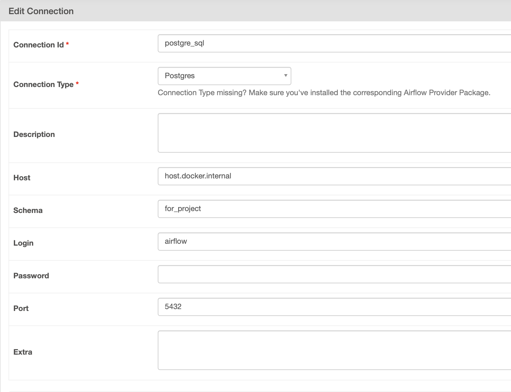
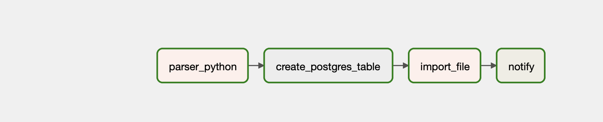
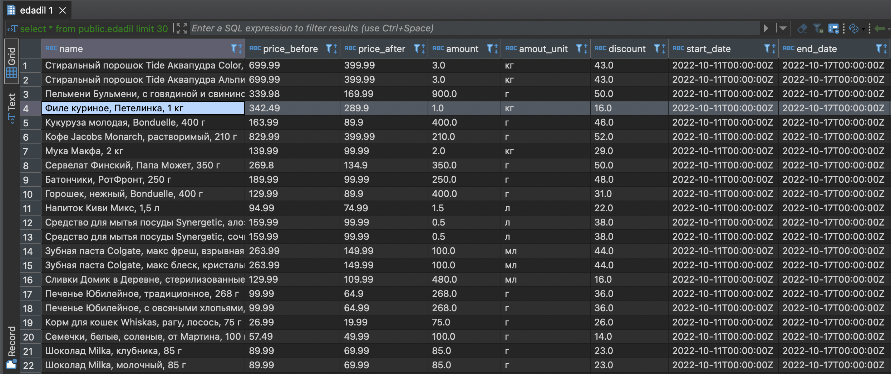

# Tutorial

## 0 part. Structure.

* _В папке dags лежат наши паттерны, их мы и запускаем_
* _В папке data лежат данные, которые мы используем, либо это место куда мы можем что-то свободно сохранить или оттуда что-то достать во время процесса_
* _Папка docker_gpu предназначена для сборки контейнера внутри образа (об этом позже)_
* _Папка log необходима для работы с docker airflow, туда записываются ~неоожиданно~ наши логи а еще и скедулер_
* _Папка modules может в себе хранить большие функци, которые не оч то удобно писать в дагах, также полезно создать папку scripts для sql запросов_
* _Dockerfile - на его основе, точнее с помощью него мы модифицируем базовый образ apache/airflow_
* _docker-compose - основа основ то из-за чего вообще все работает, грубо говоря та шутка которая нам позволяет использовать несколько образов в одном приложением и пробовать плюшки каждого без нарушения зависимостей, штука очень хрупкая и привередливая_
* _requirements - то чем мы будем дополнять apache/airflow_

## 1 part. Get started

1. Создание правильной структуры директории
  * Нужно создать точно такую же структуру как и у меня папки и файлы 
2. Скачать оригнальный [докер-компоуз](https://airflow.apache.org/docs/apache-airflow/stable/docker-compose.yaml)
3. Прописать доступы в папки 

```Bash
    - ./dags:/opt/airflow/dags
    - ./logs:/opt/airflow/logs
    - ./plugins:/opt/airflow/plugins
    - /var/run/docker.sock:/var/run/docker.sock
    - $PWD/data:/data
```
4. Добавить часть с прокси

```Bash
docker-proxy:
    image: bobrik/socat
    command: "TCP4-LISTEN:2375,fork,reuseaddr UNIX-CONNECT:/var/run/docker.sock"
    ports:
      - "2376:2375"
    volumes:
      - /var/run/docker.sock:/var/run/docker.sock
```
5. Прописать сервер для postgres
6. **На этой части мы уже можем запускать проект**

7. _Но для начала некоторые команды чтобы не гуглить_
```Bash
docker images # список образов
docker pull {image} # скачать образ
docker run -d -p {port} {image} # запуск образа по порту, флажок -d обозначает запуск через демона (фоновый режим)
docker ps -a - вывод активных контейнеров, флажок -a вывод еще и некактивные
sudo docker ps -a -q --filter ancestor = {tag or image id} # вывод что и выше только id контейнеров созданных из фильтра по образу
docker stop/start {container_id} # приостанавливает либо запускает контейнер
docker exec -it {container_id} bash # позволяет попасть в котейнер
docker kill {container_id} # более быстрый и небезопасный stop
docker rm {container_id} # удалить контейнер
docker rm $(docker ps -aq) # удалить все контейнеры
docker rmi {image} # удалить образ
docker build -t {image_name} . # создает образ на основе dockerfile текущей директории
docker build -f {Dockerfile} # либо на основе какого-то конкретного dockerfile
docker build -t test_6 -f docker_gpu/Dockerfile . --network=host --no-cache # -t tagged -f file --network for proxy --no-cache без переиспользования частей образа
docker inspect -f '{{ .Mounts}}' {container_id} # позволяет маунтить (добавлять) пути хоста к контейнеру
sudo chmod 777 -R data_download # Nb если маунтить папку к контейнеру либо добавялть путь в образ то лучше "разлочить" 
docker commit {container_id} {new_image_name} # на основе запущенного контейнера создает образ
docker-compose up airflow-init # инициализируем профиль для первого раза в airflow -> папка logs
docker-compose up -d -build # запускает процесс в фоновом режиме со сборкой необходимых образов (если есть --no-cache)
docker-compose down #  останавливает процесс
docker volume prune # очищает папки логических томов

```
8. _Полезные команды для отладки некоторых проблем в Линукс_
```Bash

systemctl restart docker - перезагружает докер в случае каких-либо сбоев (например: error response daemon)
systemctl daemon-reload - менее глобально перезагружает менеджер докера (например: registry connection refused)
mkdir -p /etc/systemd/system/docker.service.d - иногда возникают ошибки с прокси то нужно создать следующую директорию 
nano /etc/systemd/system/docker.service.d/docker.root.conf - прописать здесь прокси вида...

[Service]
Environment="HTTP_PROXY=proxy" "HTTPS_PROXY=proxy"

systemctl show --property Environment docker - должно отображать принятые изменения прокси конфиг в докере
sudo nano /etc/resolv.conf - работа с доменами

domain berkeley.edu 
search unc.edu 
nameserver 204.199.87.2 
nameserver 204.199.77.2

"airflow db init" or "aurflow initdb", "airflow scheduler", "airflow webserver" - перезагружает базы аирфлоу внутри докер контейнера (сначала exec -it ... bash), основные проблемы не отображаются логи или не обнавляются код дага в вебке
sudo pkill -9 -f "airflow scheduler"/"airflow webserver"- те же операции не внутри контейнера

```
## 2 part. Images

В Dockerfile находится сборка к базовому Python 3.7 или что-то вроде того от apache/airflow, из самого хайпового решил добавить **lgbm**, кастомим базовый apache/airflow нашим Dockerfile через команду 
```Bash
docker build ./ -t {new_image_name}
```
* _На этом моменте должен был создаться образ_

**Далее меняем в docker-compose.yml старый образ на новый следующим движением рук**

```Bash
image: ${AIRFLOW_IMAGE_NAME:-apache/airflow:2.3.0} -> image: ${AIRFLOW_IMAGE_NAME:-new_image_name}
```
**Далее запускаем наш  докер**

```Bash
docker-compose up -d
```
> На [localhost:8080](http://localhost:8080/) должен открыться airflow c нашими процессами 

## 3 part. Airflow and postgres

Для начала нужно создать подключение к нашему хосту для мак-юзеров это делается следующим образом варианты для хоста могут быть _(localhost, postgres)_



После создания подключения можно официально запускать основной даг в airflow - pre_parser.py, который имеет следующую струтуру 



* parser_python парсит данные едадила и сохраняет их в папку data по дням в формате csv
* create_postgres_table создает таблицу с необходимыми форматами данных
* import_file выгружает данные в дб ежедневно
* notify bash команда сообщающая об ошибке либо успехе всего процесса

Результат отработки процесса можно увидеть dbeaver



## 4 part. Container in Container with GPU Image

> NB: основной проблемой чего-то gpu-шного может быть связано с совместимостью сборок всего docker-compose, если нам нужно добавить, грубо говоря, образ tensorflow-gpu, который будет основной рабочей лошадкой всех процессов с нейронными сетками, нужно делать кастомизацию каждого образа внутри docker-compose начиная от веб-сервера, планировщика и до основного apache/airflow


